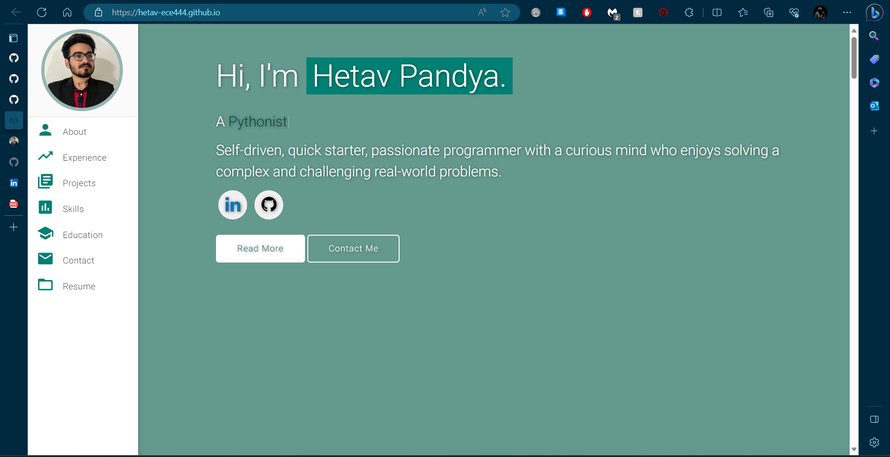
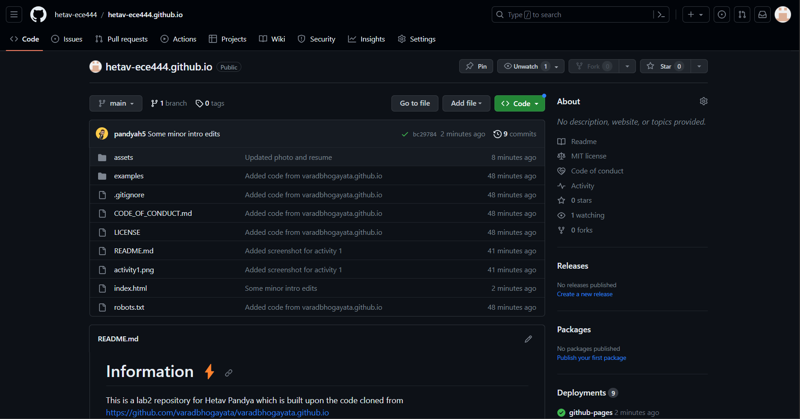
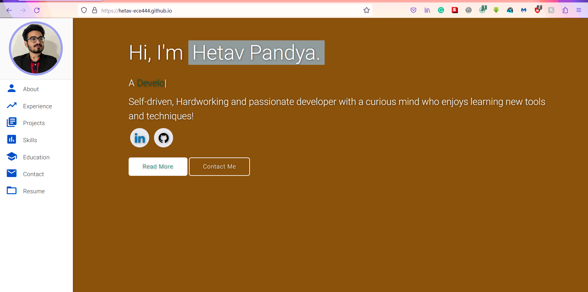
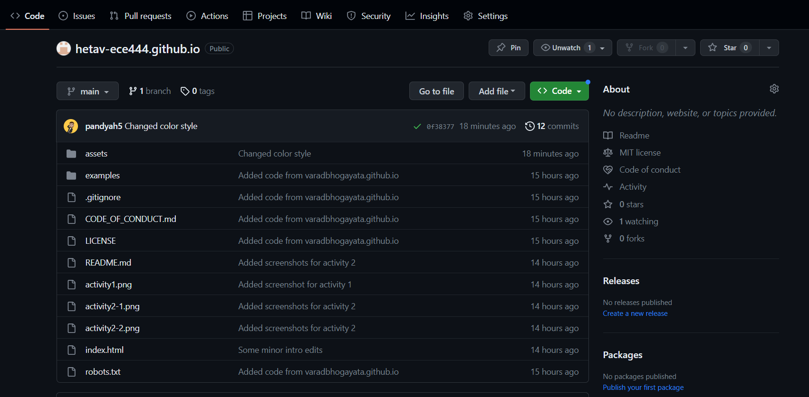
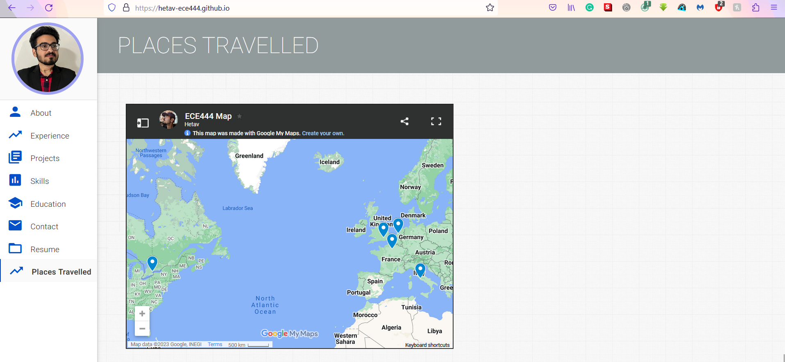
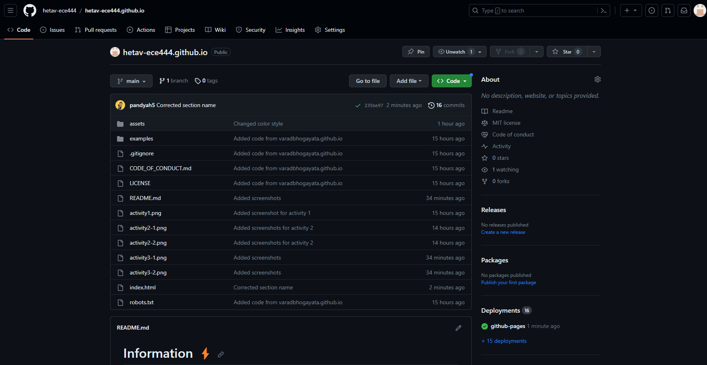

# Information ⚡️
This is a lab2 repository for Hetav Pandya which is built upon the code cloned from https://github.com/varadbhogayata/varadbhogayata.github.io

### Activity 1: 
Screenshot showing that all files have been added to my new repo

### Activity 2: 
Screenshot of the webpage after changing the content

Screenshot of the repo after changing the contents

### Activity 3:
Screenshot showing a new color theme

Screenshot of the repository after activity 3

### Activity 4:
Screenshot of the places travlled section with the map

Screenshot of the repository after activity 4

